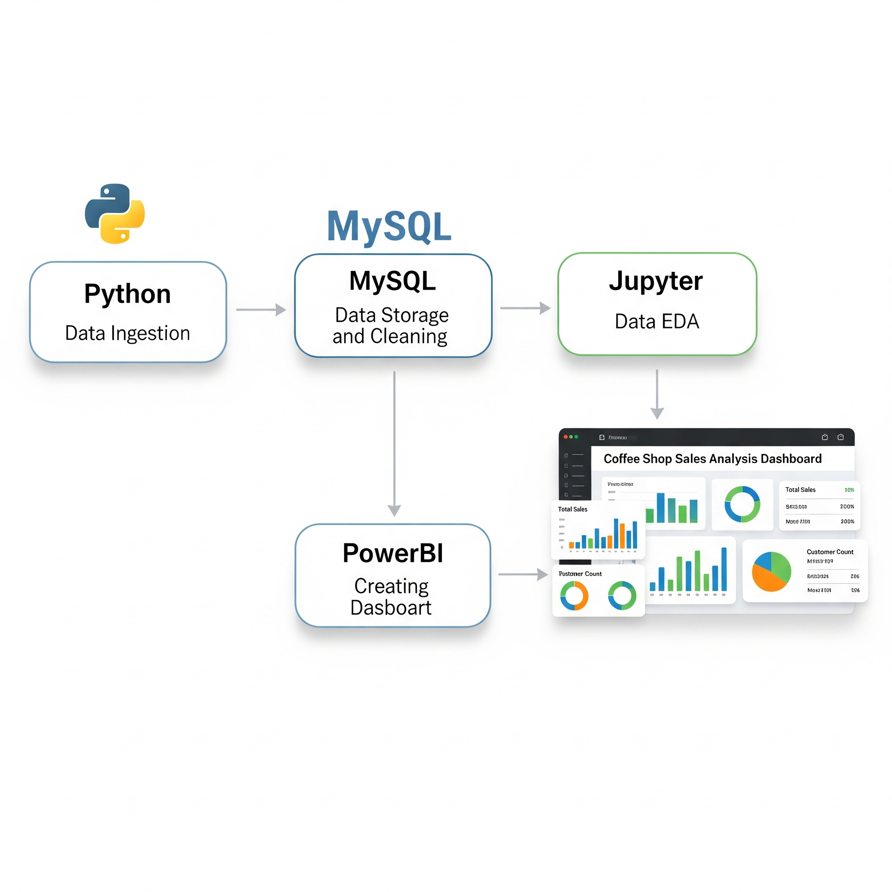
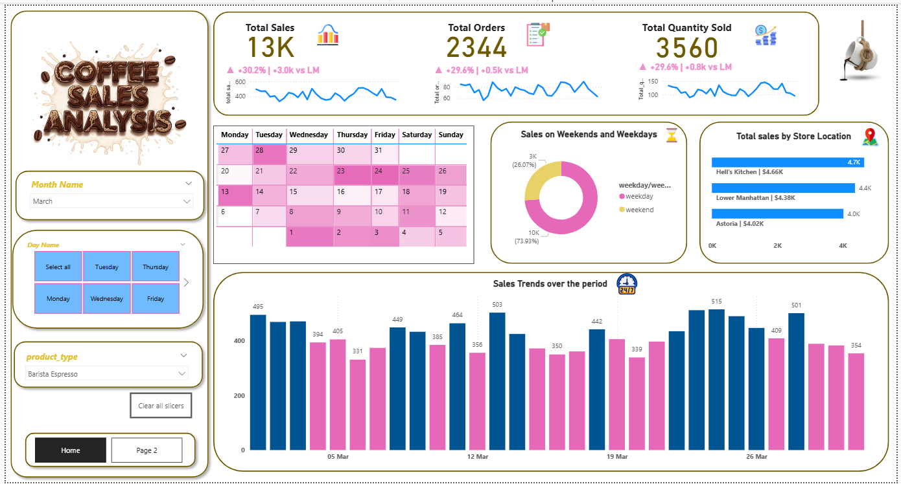
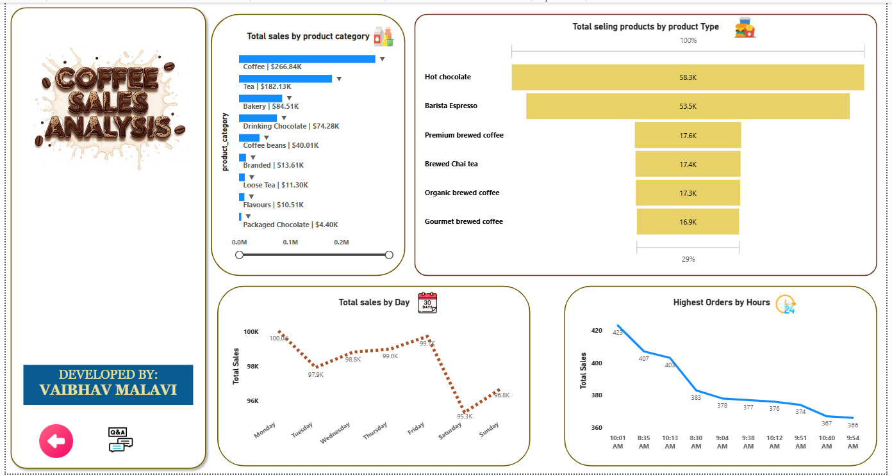

# ☕ Coffee Shop Sales Analysis

🚀 **Project Goal:**  
To automate and visualize sales insights from a coffee shop dataset using Python, MySQL, Jupyter Notebook, and Power BI. The project ensures 100% match between SQL query results and Power BI visualizations.

---

## 🛠️ Tech Stack
- **Python**: Data ingestion, cleaning, logging
- **MySQL**: Data storage & query processing
- **Jupyter Notebook**: EDA & validation
- **Power BI**: Dashboard creation & visualization

---
## 🔁 Project Pipeline


### 🔧 Steps:
1. **Ingest** → Python script loads CSV to MySQL
2. **Store** → Cleaned data stored in MySQL
3. **Analyze** → SQL queries for KPIs
4. **Visualize** → Jupyter & Power BI use MySQL data
5. **Result** → Dashboard insights with 100% data match

---
## 📈 Key KPIs
- ✅ **Total Sales**
- ✅ **Total Orders**
- ✅ **Total Quantity Sold**

---
## 📊 Power BI Dashboard
### 🏠 Home Page


- KPI cards
- Calendar Matrix (dark pink = high sales)
- Donut chart: Weekday vs Weekend
- Line chart: Top 10 busy hours
- Slicers: Month, Day, Product Type
### 📄 Page 2


- Bar chart: Sales by Store Location
- Line & Stacked Column: Sales over time
- Funnel Chart: Top Products
- Line Chart: Daily trend

---
## 📁 Project Structure

```
📦 Coffee-Shop-Sales-Analysis
├── assets/
│   └── pipeline.png
├── data/
│   └── raw_sales_data.csv
├── logs/
│   └── etl_log.txt
├── notebooks/
│   └── eda_analysis.ipynb
├── powerbi/
│   ├── coffee_dashboard.pbix
│   ├── Home.png
│   └── Page2.png
├── scripts/
│   └── load_and_clean_data.py
├── sql/
│   └── kpi_queries.sql
└── README.md
```

---
## ✅ Outcome
- ⏱️ End-to-end automation from raw data to dashboard
- 🎯 Accurate insights verified with SQL & Power BI
- 📊 Interactive visuals for smart business decisions

---

> 💡 Tip: You can schedule the Python script to run automatically using Task Scheduler (Windows) or CRON (Linux/macOS).

---
